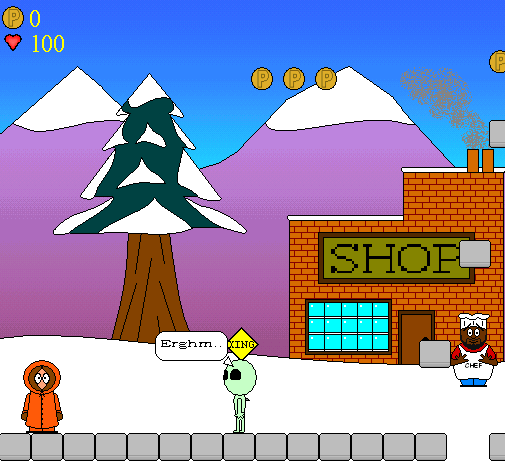



## South Park Platform Game

### Description

This is a FUN platform game based loosely on South Park.

It contains a lot of graphical API use.

The code is not particularly neat, but the game is pretty good considering it's in VB6. I also turned it into a macro (i.e. made it work in VBA) but that is a different story. Huge thanks go to dark phoenix, who did the graphics (mostly from scratch in nothing but MSPaint!). Let me know of any bugs, although I know of a few already.
 
### More Info
 

             |
---                |---
**Submitted On**   |2005-08-15 13:15:28
**By**             |[Adlib Logic](https://github.com/Planet-Source-Code/PSCIndex/blob/master/ByAuthor/adlib-logic.md)
**Level**          |Advanced
**User Rating**    |5.0 (40 globes from 8 users)
**Compatibility**  |VB 6\.0
**Category**       |[Games](https://github.com/Planet-Source-Code/PSCIndex/blob/master/ByCategory/games__1-38.md)
**World**          |[Visual Basic](https://github.com/Planet-Source-Code/PSCIndex/blob/master/ByWorld/visual-basic.md)
**Archive File**   |[South\_Park192941932005\.zip](https://github.com/Planet-Source-Code/adlib-logic-south-park-platform-game__1-62423/archive/master.zip)

